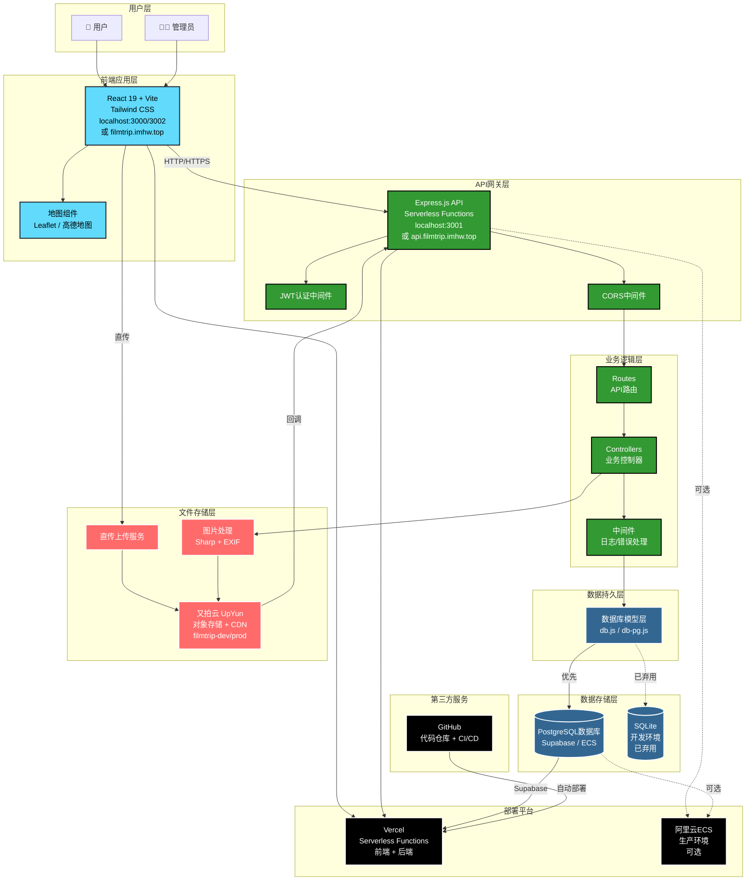
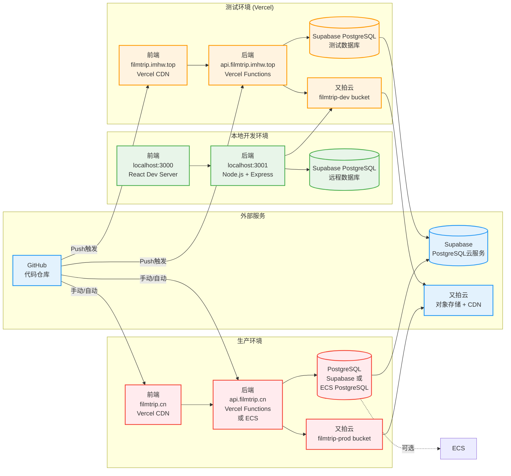
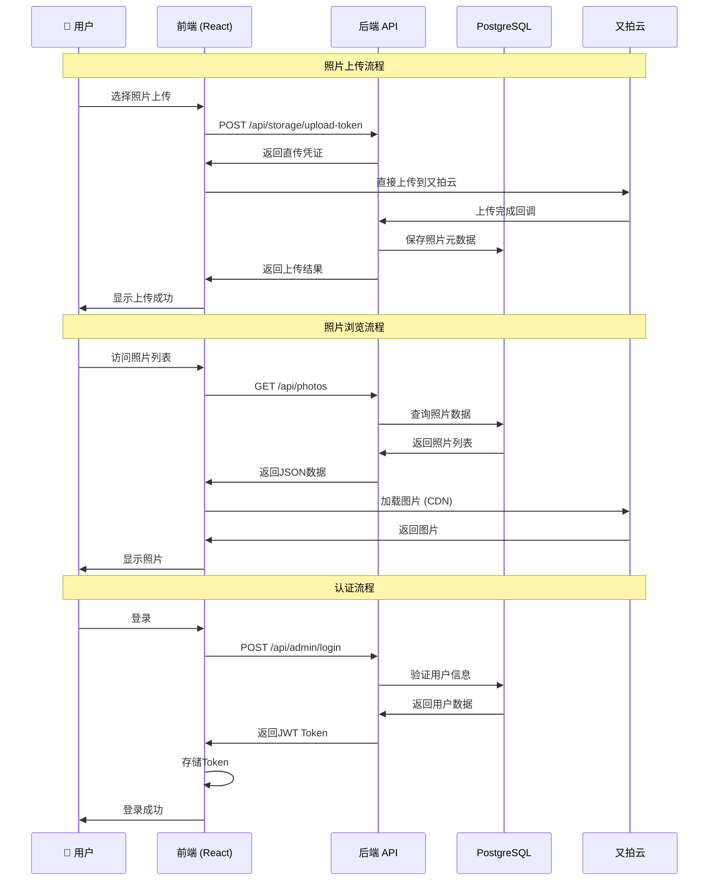
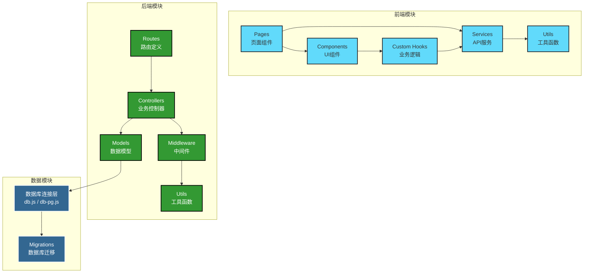
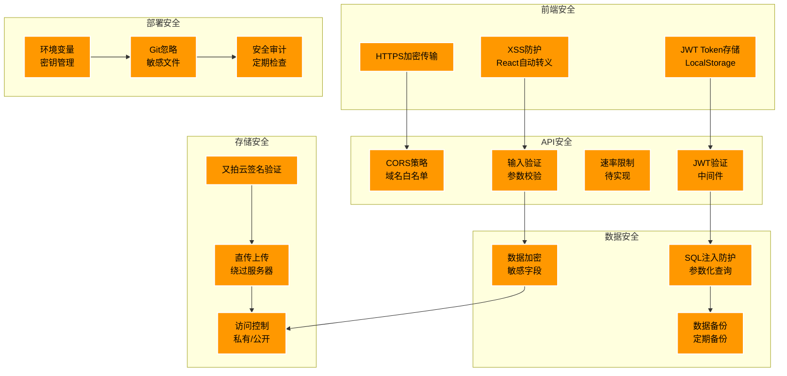

# FilmTrip 系统架构图

**版本**：v1.0  
**最后更新**：2025-11-14  
**状态**：PostgreSQL迁移中

---

## 📊 整体系统架构

---

## 🌍 部署架构图

---

## 🔄 数据流架构图

---

## 🏗️ 技术栈架构

```mermaid
graph TD
    subgraph "前端技术栈"
        React[React 19]
        Vite[Vite 7]
        Tailwind[Tailwind CSS]
        Router[React Router]
        Leaflet[Leaflet / 高德地图]
        Axios[Axios HTTP Client]
        Motion[Framer Motion]
    end

    subgraph "后端技术栈"
        Node[Node.js]
        Express[Express 5]
        JWT[JWT认证]
        Sharp[Sharp图片处理]
        Multer[Multer文件上传]
        Morgan[Morgan日志]
        CORS[CORS中间件]
    end

    subgraph "数据库技术栈"
        PG[PostgreSQL]
        PGPromise[pg-promise]
        Supabase[Supabase SDK]
    end

    subgraph "存储技术栈"
        UpYunAPI[又拍云 API]
        CDN[CDN加速]
        DirectUpload[直传上传]
    end

    subgraph "部署技术栈"
        VercelDeploy[Vercel部署]
        Serverless[Serverless Functions]
        GitHubActions[GitHub Actions CI/CD]
    end

    React --> Vite
    Vite --> Tailwind
    React --> Router
    React --> Leaflet
    React --> Axios
    React --> Motion

    Node --> Express
    Express --> JWT
    Express --> Sharp
    Express --> Multer
    Express --> Morgan
    Express --> CORS

    PG --> PGPromise
    PG --> Supabase

    UpYunAPI --> CDN
    UpYunAPI --> DirectUpload

    VercelDeploy --> Serverless
    GitHubActions --> VercelDeploy

    %% 样式
    classDef frontend fill:#61dafb,stroke:#20232a,stroke-width:2px
    classDef backend fill:#339933,stroke:#000,stroke-width:2px,color:#fff
    classDef database fill:#336791,stroke:#fff,stroke-width:2px,color:#fff
    classDef storage fill:#ff6b6b,stroke:#fff,stroke-width:2px,color:#fff
    classDef deploy fill:#000,stroke:#fff,stroke-width:2px,color:#fff

    class React,Vite,Tailwind,Router,Leaflet,Axios,Motion frontend
    class Node,Express,JWT,Sharp,Multer,Morgan,CORS backend
    class PG,PGPromise,Supabase database
    class UpYunAPI,CDN,DirectUpload storage
    class VercelDeploy,Serverless,GitHubActions deploy
```

---

## 📦 模块依赖关系图

---

## 🔐 安全架构图

---

## 📊 组件说明

### 前端层 (Frontend Layer)
- **技术栈**：React 19 + Vite + Tailwind CSS
- **主要功能**：
  - 照片浏览（画廊/瀑布流/时间轴/地图）
  - 照片上传和管理
  - 胶卷和胶片类型管理
  - 用户认证界面
- **部署**：Vercel CDN

### API层 (API Gateway Layer)
- **技术栈**：Node.js + Express 5
- **部署方式**：Vercel Serverless Functions
- **主要功能**：
  - RESTful API接口
  - JWT认证和授权
  - CORS策略管理
  - 请求日志记录

### 业务逻辑层 (Business Logic Layer)
- **Controllers**：处理业务逻辑
- **Routes**：定义API路由
- **Middleware**：请求预处理（日志、错误处理等）

### 数据持久层 (Data Persistence Layer)
- **数据库**：PostgreSQL（Supabase或ECS）
- **ORM/查询**：pg-promise
- **迁移**：自建迁移脚本

### 文件存储层 (File Storage Layer)
- **服务商**：又拍云（UpYun）
- **功能**：
  - 对象存储（filmtrip-dev/prod buckets）
  - CDN加速
  - 直传上传
  - 图片处理（水印、缩放等）

### 部署平台 (Deployment Platform)
- **Vercel**：前端和后端Serverless部署
- **ECS**（可选）：生产环境传统服务器部署

---

## 🔄 数据流说明

### 上传流程
1. 用户在前端选择照片
2. 前端请求后端获取上传凭证
3. 前端直接上传到又拍云
4. 又拍云回调后端API
5. 后端处理图片（EXIF、缩略图等）
6. 后端保存元数据到数据库
7. 前端显示上传结果

### 浏览流程
1. 用户访问照片列表
2. 前端请求API获取照片数据
3. API从数据库查询元数据
4. 前端从CDN加载图片
5. 用户浏览照片

### 认证流程
1. 用户输入账号密码
2. 前端发送登录请求
3. 后端验证用户信息
4. 后端生成JWT Token
5. 前端存储Token
6. 后续请求携带Token

---

## 🚀 部署说明

### 本地开发环境
- **前端**：`localhost:3000` 或 `localhost:3002`
- **后端**：`localhost:3001`
- **数据库**：Supabase PostgreSQL（远程）

### 测试环境
- **前端**：`https://filmtrip.imhw.top`
- **后端**：`https://api.filmtrip.imhw.top`
- **数据库**：Supabase PostgreSQL（测试数据库）
- **存储**：又拍云 `filmtrip-dev` bucket

### 生产环境
- **前端**：`https://filmtrip.cn`
- **后端**：`https://api.filmtrip.cn`
- **数据库**：Supabase PostgreSQL 或 ECS PostgreSQL（待定）
- **存储**：又拍云 `filmtrip-prod` bucket

---

## 📚 相关文档

- [环境配置方案](../deployment/environment-strategy.md)
- [部署指南](../guides/部署指南.md)
- [PostgreSQL迁移方案](../deployment/postgresql-migration-supabase.md)
- [安全审计报告](../security/security-audit-2025-11-14.md)

---

**最后更新**：2025-11-14  
**维护者**：FilmTrip开发团队

